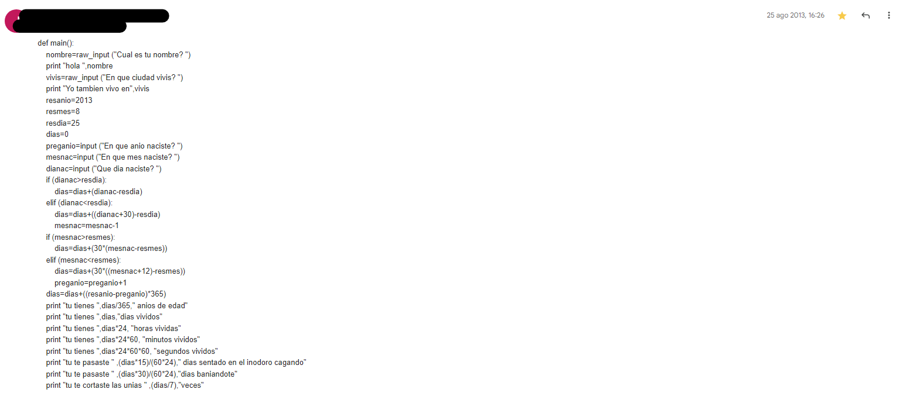
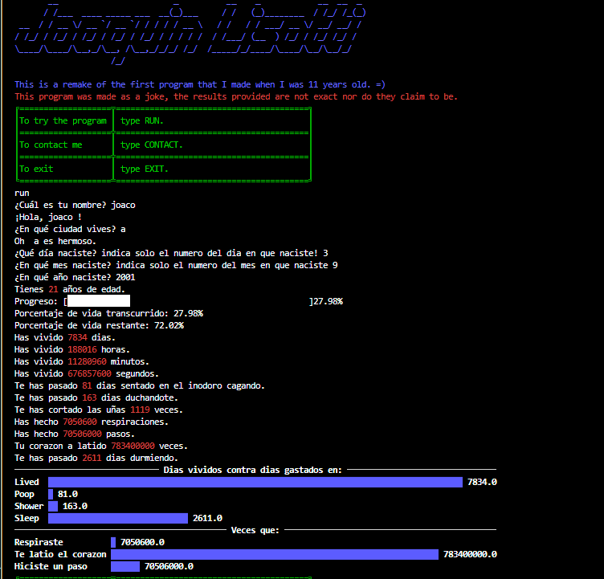

# My-first-program-ever
This a the first program i ever wrote. I was 11 years old (2013) and bored at my grandparent's house, so i asked my dad to donwload Python for me. I learned it on the internet. 
I found the code some years ago traing to find some old mails.  
Original mail, sent it on 25 augost of 2013

It was made on an old version of Python, (2.x) I dont remember the exactly version.
Here you will find the original code and a remake that i made on 24/5/2023, so its a 10 years remake for a unusable code.  
This is how the output looks like :)

